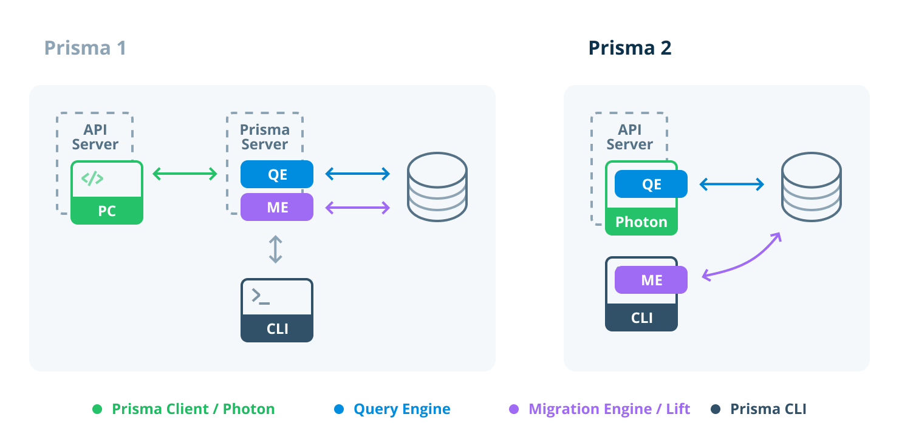

# 目次

- [目次](#目次)
- [環境構築](#環境構築)
- [技術スタック](#技術スタック)
  - [共通](#共通)
  - [フレイムワーク](#フレイムワーク)
  - [フロントエンド](#フロントエンド)
  - [バックエンド](#バックエンド)
  - [データベース](#データベース)
  - [ライブラリー](#ライブラリー)
  - [バグ](#バグ)
  - [実装予定](#実装予定)
  - [実装検討](#実装検討)
- [サーバーコマンド一覧](#サーバーコマンド一覧)
  - [prisma コマンド](#prisma-コマンド)
  - [起動コマンド](#起動コマンド)
  - [prisma コマンド](#prisma-コマンド-1)
  - [docker 操作](#docker-操作)
  - [データベース操作](#データベース操作)
- [docker 説明](#docker-説明)
  - [docker-compose.yml と docker-compose-prod.yml 主な違いのまとめ](#docker-composeyml-と-docker-compose-prodyml-主な違いのまとめ)
  - [docker-compose.yml](#docker-composeyml)
- [](#)
  - [docker-compose-prod.yml](#docker-compose-prodyml)
- [参考資料](#参考資料)

# 環境構築

[開発環境構築手順](/memo/環境構築.md)

[本番環境構築手順](/memo/本番環境構築.md)

# 技術スタック

## 共通


## フレイムワーク


## フロントエンド


## バックエンド


## データベース


## ライブラリー


framer-motion  //使いたい機能・アニメーション  
react-icons  //使いたい機能・アイコン

## バグ

```bash
・カレンダーで選択した日付の一日前になる # 修正済み
・すでに過ぎた時間帯や日にちも予約できてしまう
・カレンダーに月や年を素早く切り替えるものが無い
・人数が０以下も入れれちゃう
・タイムラインのフィルター機能を使うとデザインが変わる
・最初に読み込まれるタイムラインの表記は当日でデータが一日前になっている # 修正済み
・選択した部屋がどこの何時かを予約のホップアップで表示する
・ログページのログがすべてで申請中/認可/却下の区別。 # 修正済み
・別の端末で予約した変更がページを再読み込みしないと反映されない
```

## 実装予定

```bash
・部屋を選択した際に24時間グラフを使って視覚的に一目で空いている時間が分るやつ # 実装済み
・借りれない時間帯を選択できないようにする # 実装済み
・部屋の登録情報を完成させる # 実装済み
・部屋管理で借りられている状態が一目でわかる # 実装済み
・予約した際の成功や失敗メッセージを作成/現在も出てくるが分かりにくいため # 実装済み
・予約取り消し機能 # 実装済み
```

## 実装検討

・ユーザー管理
・権限管理
・授業登録画面
・掲示板
・インターネットアクセス

# サーバーコマンド一覧

## prisma コマンド

```bash
npm run db:seed #データベースに必要なデータを作成する
# or
npx prisma studio #prismaを直接操作確認できる
# or
npx prisma generate #スキーマやモデルを変えた際反映させるコマンド
# or
npx prisma migrate dev
```

## 起動コマンド

```bash
npm run dev # next.jsの起動コマンド
# or
npm run build # 確認コマンド
# or
docker-compose up # 起動コマンド
# or

```

## prisma コマンド

```bash
npx prisma studio --port 5555   #確認
# ro
npx prisma generate # Prismaクライアントを更新して新しいスキーマを反映
# or
npx prisma migrate dev --name init # マイグレーションフォルダの生成
# or
npx prisma init # Prismaの初期化

```

## docker 操作

```bash
docker-compose up # 起動コマンド
# or
docker-compose up -d # 動作確認
# or
docker compose exec database bash # dockerからMySQLコンテナ(database)に接続
# or
docker inspect -f '{{.Name}} - {{range .NetworkSettings.Networks}}{{.IPAddress}}{{end}}' $(docker ps -aq) # コンテナのIPアドレスを表示
# or
docker volume rm ボリューム名 # volumeの削除
# or
docker volume ls # ボリューム一覧
# or
docker ps -a --filter volume=my-app_database # コンテナID一覧
# or
docker stop コンテナID # コンテナを止める
# or
docker rm コンテナID # コンテナの削除
# or
```

## データベース操作

```bash
docker ps -a
# or
docker exec -it next.js-test-network-db psql -U tt -d DB  # コンテナ内でユーザー（ロール）を確認
# or
docker exec -it <正しいコンテナ名> psql -U postgres -d DB
# or
docker exec -it next.js-test-network-db ls -l /docker-entrypoint-initdb.d/
#or
\q #終了
#or

```

# docker 説明

### docker-compose.yml と docker-compose-prod.yml 主な違いのまとめ

- 用途の違い\
  docker-compose.yml: 開発環境用。ローカルでの開発とデバッグに最適。\
  docker-compose-prod.yml: 本番環境用。デプロイと運用に最適。\

- 設定の違い:\
  開発用では、ホットリロードやデバッグツールの設定を含むことが多い。\
  本番用では、パフォーマンスやセキュリティを考慮し、不要な開発ツールやデバッグ設定を省略。\

- 環境変数:\
  本番用では NODE_ENV=production のように環境変数を設定し、最適なパフォーマンスを発揮するようにします。\

### docker-compose.yml

主な用途: 開発環境の設定。

- 特徴:

- ローカル開発で必要な設定を含む。
  より頻繁なコード変更やデバッグに対応。\
  デバッグツールやホットリロードなど、開発を助けるための設定が含まれることが多い。\
  ボリュームマウントを利用して、ホストのファイルシステムとコンテナ内のファイルシステムを同期。\

#

### docker-compose-prod.yml

主な用途: 本番環境の設定。

- 特徴:

- 本番環境でのデプロイに必要な設定を含む。\
  高可用性、スケーラビリティ、セキュリティを考慮した設定。\
  デバッグツールやホットリロードなどの開発用の設定を省略。\
  パフォーマンス最適化のための設定が含まれることが多い。

# 参考資料

[絵文字](https://zenn.dev/cube_3110/articles/2d0cc2e6b863ca)

[Next.js の理解](https://qiita.com/tomy0610/items/f07d586c08a0a2aadb01#%E5%89%8D%E6%8F%90)

[【入門】Prisma を始めるときに押さえておきたいポイントまとめ](https://share.google/bHz3caiBXmmhBTbIK)


